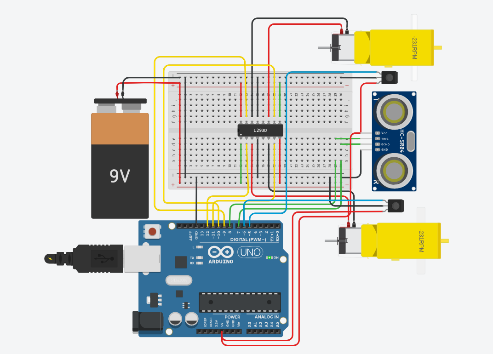

# Obstacle-and-fall-avoiding-bot

Obstacle-and-fall-avoiding-bot is a simple Arduino-based autonomous bot it uses IR sensor module and Ultrasonic Sensor to sense the surface and the obstacle consecutively and avoid obstacle while remaining on the surface.

## Components Used

1. Arduino Uno
2. IR sensor module *2
3. Ultrasonic Sensor HC-SR04
4. Motor Driver L298N
5. BO motor *2
6. Powerbank

The components used in actual project may not match the components used in Tinkercad Simulation.

## Tinkercad Schematic

## Working

The connections are made as shown in the above figure. Ultrasonic sensor and IR sensors are used for obstacle and surface detection respectively. A power bank of 5v is used as a power supply that powers the Arduino and motor driver.  Input from sensors are taken and according to those values vehicle either moves forward or backward or rotates right. The IR sensor returns LOW if it detects the surface, using that info the bot first checks if it is on a surface and then it tries to avoid the obstacle with the help of proximity data provided by the Ultrasonic sensor. L298N H-bridge motor driver is used for motor control (doesn't match with the schematic as the component is not available in Tinkercad). The motor driver receives the control signal from Arduino and drives the motor as described in the code with the help of sensor data.
## Watch The Video

  

